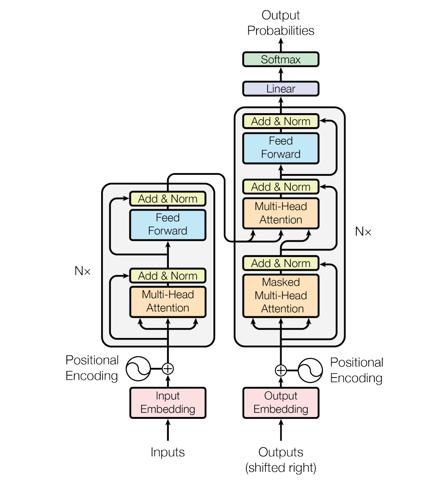
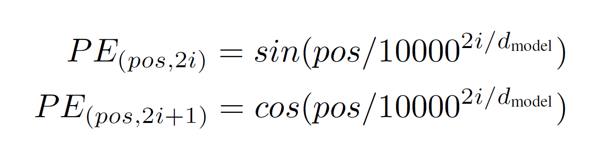

# Attention is All you need report

## 论文链接：[Transfomer论文](https://arxiv.org/abs/1706.03762)

## 视频链接：[视频讲解](https://www.bilibili.com/video/BV1pu411o7BE/?spm_id_from=333.999.0.0&vd_source=6e22f74cbbb0cdf9444235d6ad11aabf)

## 一：论文精读与注释：

### 一：摘要：

主流的序列转导模型【1】基于复杂的循环神经网络【2···】或卷积神经网络【3···】，这些网络包括编码器和解码器【4】。表现最好的模型还通过注意力机制【5···】连接编码器和解码器。我们提出了一种新的简单网络架构——Transformer，它完全基于注意力机制，完全摒弃了递归和卷积。对两个机器翻译任务的实验表明，这些模型在质量上更优，同时并行性更强，训练时间显著减少。我们的模型在WMT 2014英语到德语翻译任务上达到了28.4 BLEU分数，超过现有最佳结果（包括集成模型）2 BLEU以上。在WMT 2014英语到法语翻译任务中，我们的模型在8个GPU上训练3.5天后达到了新的单模型最优BLEU分数41.8，仅为文献中最佳模型训练成本的一小部分。我们还通过将其成功应用于英语成分解析任务，展示了Transformer在其他任务上的良好泛化能力，无论是大数据还是小数据训练。

**理解：主要讲述了Transformer作为一种全新的网络架构在机器翻译任务上表现了特别好的成果并且它完全基于注意力机制，相比于递归神经网络和卷积神经网络有很大的优势，尤其是在并行性和训练时间上。并且现在在其他NLP任务和图片视频等多个领域（多模态）表现出了很好的效果。**
**对于RNN这种处理时序序列的模型，当你的输入序列特别长的时候，由于并行性不好，计算所需时间就很长。**

【1】：**序列传导模型**：序列传导模型是处理输入序列并将其转换为输出序列的模型，常用于任务如机器翻译、语音识别和图像字幕生成。这些模型的主要目标是捕捉输入序列中的复杂依赖关系并生成相应的输出序列

【2···】：**RNN（循环神经网络）**：一种适合处理序列数据的神经网络。RNN通过循环连接来处理序列中的时间依赖关系，即它们在每个时间步的计算不仅依赖于当前输入，还依赖于前一个时间步的隐藏状态。常见的RNN变种包括长短期记忆网络（LSTM）和门控循环单元（GRU）

【3···】：**CNN（卷积神经网络）**：一种主要用于处理网格结构数据（如图像）的神经网络。CNN通过卷积操作来提取数据的局部特征。尽管CNN通常用于图像处理，它们也可以应用于序列数据，例如文本分类或时间序列分析。

【4】：**编码器-解码器架构**：序列传导模型中常见的结构，用于将输入序列映射到中间表示，再将其转换为输出序列

【5···】：**注意力机制**：注意力机制允许模型在处理序列数据时，有选择地关注输入序列的不同部分，从而更好地捕捉长距离依赖关系。

------

### 二：结论：

我们提出了Transformer，一种全新的序列转导模型，完全基于注意力机制。通过摒弃递归和卷积操作，我们大大提高了模型的训练效率和并行性，同时在多个翻译任务上达到了最先进的性能。我们认为Transformer架构在许多其他序列建模任务中也具有广泛的应用前景。

**理解：Transformer在其他的方向上有更多的应用前景；**

------

### 三：导言：

递归神经网络（RNN）、长短期记忆（LSTM）和门控递归单元（GRU）神经网络在序列建模和转导问题（如语言建模和机器翻译）中已被确立为最先进的方法。自此以来，许多努力继续推动递归语言模型和编码器-解码器架构的边界。

递归模型通常沿输入和输出序列的符号位置分解计算。将位置与计算时间步骤对齐，它们生成一系列隐藏状态ht，作为前一隐藏状态ht−1和位置t的输入的函数。**这种固有的顺序性在训练示例中限制了并行化**，这在较长的序列长度下变得至关重要，**因为内存限制了跨示例的批处理**。最近的工作通过**因子化技巧**【6】和**条件计算**【7】在计算效率上取得了显著改进，同时在后者的情况下也提高了模型性能。然而，顺序计算的基本限制仍然存在。

注意力机制已成为各种任务中引人注目的序列建模和转导模型的一个组成部分，允许在输入或输出序列中的任意位置之间建模依赖性。然而，除少数情况外，这些注意力机制通常与递归网络结合使用。

在这项工作中，我们提出了Transformer，一种摒弃递归，**完全依赖注意力机制在输入和输出之间绘制全局依赖关系的模型架构**。Transformer允许显著更多的并行化，并且在8个P100 GPU上训练仅12小时后就能达到新的翻译质量的最先进水平。

**理解：第一段话讲述了对于现阶段（2017）当时的主流方法是RNN的LSTM和GRU等，两个主流的模型一个是语言模型，另一个是编码器和解码器的结构。第二段是讲述RNN的特点，它的计算是把给定的序列从左往右一步步往前做，如果是一个句子就是一个词一个词往前看。RNN这样就可以把前面的信息放在t-1的隐藏状态下，在处理时序问题上有很好的效果。但同样的在并行性上能力低，导致在计算性能上比较差，时间需要比较长。同样的如果给定的序列比较长，就可能抛弃掉前面的一些信息，否则需要很大的ht，导致内存开销比较大。注意力机制已经在RNN上有所应用，那么现在提出了Transformer，完全基于注意力做出了更好的结果。**

【6】：**因子化技巧**：因子化技巧是一种通过将复杂的计算过程分解为更简单和更易计算的部分来优化模型的方法。因子化技巧在RNN中可以帮助减少计算量，降低内存需求，从而提升训练速度和效率。

1. **权重因子化（Weight Factorization）**：在RNN中，可以将大的权重矩阵分解为两个更小的矩阵。这种方法减少了参数的数量，从而加速计算并减小模型的内存占用。

   例如，将一个权重矩阵 W 分解为两个矩阵 W1 和 W2：
   
   $$ 
   W \approx W_1 \times W_2 
   $$

   通过这种分解，可以减少计算复杂度，提高训练效率。

3. **张量分解（Tensor Factorization）**：将高维张量分解为低维张量的乘积，从而减少计算量。这在处理高维输入数据时特别有效。

【7】：**条件计算**：是一种通过动态地选择哪些部分的网络进行计算来优化模型的方法。这种方法可以减少不必要的计算，从而提升效率。

1. **跳跃连接（Skip Connections）**：根据输入数据的特性，动态选择是否跳过某些层的计算。这种方法在深度网络中可以有效减轻梯度消失问题，并加速训练过程。
2. **门控机制（Gating Mechanisms）**：如LSTM和GRU中使用的门控机制，根据输入和隐藏状态的不同，动态选择哪些信息需要更新，哪些信息需要保留。这种方法使模型能够根据输入数据的不同，灵活地调整计算路径。
3. **稀疏激活（Sparse Activations）**：通过稀疏激活函数，只激活一部分神经元，从而减少计算量。比如，在每个时间步只激活输入数据最相关的部分。

------

### 四：背景相关工作：

减少序列计算的目标也是扩展神经GPU（Extended Neural GPU）[16]、ByteNet [18] 和 ConvS2S [9]的基础，这些模型都使用卷积神经网络作为基本构建块，以便对所有输入和输出位置的隐藏表示进行并行计算。在这些模型中，两个任意输入或输出位置之间的信号关联**所需的操作数随位置之间的距离增加而增长**，对于ConvS2S是线性增长，而对于ByteNet是对数增长。这使得学习远距离位置之间的依赖关系变得更加困难[12]。在Transformer中，这种操作数减少到了一个常数，尽管代价是**由于平均注意力加权位置导致的有效分辨率降低**，这种影响我们通过第3.2节中描述的**多头注意力机制进行对抗**。

自注意力机制，有时称为内部注意力，是一种将单个序列的不同位置关联起来以计算该序列表示的注意力机制。自注意力机制已经成功应用于各种任务，包括阅读理解、抽象摘要、文本蕴含和学习任务无关的句子表示[4, 27, 28, 22]。

端到端记忆网络基于一种循环注意力机制，而不是基于序列对齐的递归机制，已被证明在简单语言问答和语言建模任务中表现良好[34]。

据我们所知，Transformer是第一个完全依赖自注意力机制来计算输入和输出表示的转换模型，**而没有使用序列对齐的RNN或卷积**。在接下来的章节中，我们将描述Transformer，阐述自注意力机制，并讨论其相对于[17, 18]和[9]等模型的优势

**理解：使用卷积神经网络，在对于比较长的序列难以建模，如果两个像素比较远，就需要很多层卷积才能实现，但是Transformer就可以做到一次性看到一层（扩大感受野），多个输出通道使得卷积神经网络能够在同一层中捕捉到输入数据的多种不同特征，那么相应对于Transformer，我们提出了多头注意力机制。**

------

### 五：模型架构：

大多数竞争性的神经序列转导模型具有编码器-解码器结构[5, 2, 35]。在这种结构中，编码器将符号表示的输入序列 (x1, ..., xn) 映射到一个连续表示序列 z = (z1, ..., zn)。给定 z，解码器然后逐个生成符号的输出序列 (y1, ..., ym)。在每一步，模型都是自回归的[10]，在生成下一个符号时使用前面生成的符号作为额外的输入。Transformer 遵循这种总体架构，对于编码器和解码器都使用堆叠的自注意力和逐点的全连接层，如图1的左右两半所示。

 <td></td>

**解读：对于编码器给定序列，会把原始输入转换为**相应的向量表示**，对于解码器会拿到编码器的输出一个长度的序列（可能不一样长），对于将输出再次作为输入，就是我们说的自回归，也就是RNN中的R，**过去时刻的输出作为当前时刻的输入** **

#### 第一部分：编码器与解码器：

编码器：编码器由一个堆叠的N=6个相同的层组成。每一层都有两个子层。第一个子层是一个**多头自注意力机制**，第二个子层是一个简单的逐位置**全连接前馈网络（MLP）**【8】。我们在每个子层周围使用了**残差连接**【9】，然后进行**层归一化**[1]。也就是说，每个子层的输出是LayerNorm(x + Sublayer(x))，其中Sublayer(x)是子层本身实现的函数。为了方便这些残差连接，模型中的**所有子层以及嵌入层都生成维度为d_model=512的输出**。

解码器：解码器也由一个堆叠的N=6个相同的层组成。除了每个编码器层中的两个子层外，解码器还插入了一个第三子层，该子层对编码器堆栈的输出执行多头注意力。与编码器类似，我们在每个子层周围使用了残差连接，然后进行层归一化。我们还修改了解码器堆栈中的自注意力子层，以防止位置关注到后续位置。**这种掩码，结合输出嵌入偏移一个位置的事实，确保了位置i的预测只能依赖于位置小于i的已知输出**。

**解读：实际上有关于编码器解码器就是两个参数可调（有多少层transformer block和维度）；**

 #### 对比解读：Batchnorm（批量归一化）和layernorm（层归一化）：

**Batchnorm：每一行是样本，每一列是特征（二维矩阵），每一次把每一个列（在minibatch里取同一特征实现均值为0方差为1标准化**

**layerNorm：对每个样本不同特征进行归一化。**

**但正常情况下输入是序列的样本，每个样本都有相应的小元素。转换为3维。但在持续序列里，样本的长度可能会发生变化，可能是长度特别长，也可能是短，那么这时如果按照batchnorm归一就会导致再遇见一个新的很长的样本，我们算总体的均值方差就效果不好，而如果选择layernorm，对每个样本只需要进行单独的计算，而不用进行全局计算，对新数据在单独的样本中算均值，相对稳定一些。**

**对于解码器这里，在注意力机制我们可以看到完整的输入，为了避免训练（train）出现在解码器t时刻输出时借助t时刻之后输入进行预测（避免使用未来信息），所以使用带掩码的注意力机制来限制。**

#### 第二部分：注意力：

注意力函数可以描述为将一个查询和一组键-值对映射到一个输出，其中查询、键、值和输出都是向量。输出被计算为值的加权和，其中分配给每个值的权重是通过查询与相应键的兼容性函数计算的。

 <td></td>

**解读：因为计算为值的加权和，这里的输出与值的维度相同**

【8】：MLP：是一种**前馈神经网络**，通常包括一个输入层、一个或多个隐藏层以及一个输出层。每一层都是由一组神经元组成，这些神经元通过权重和偏置相连。MLP的每个神经元接收前一层的输入，应用一个激活函数，然后将输出传递给下一层。常见的激活函数包括ReLU、sigmoid和tanh。

【9】：残差连接：是深度神经网络中的一种技巧，旨在解决深层网络中的**梯度消失和梯度爆炸**问题。残差连接通过在神经网络的某些层之间添加“快捷路径”或“跳跃连接”，允许梯度直接从后面的层传递到前面的层，从而使模型更容易训练。

$$
output = LayerNorm(x+Sublayer(x)) 
$$

通过这种方式，残差连接使得每一层仅需学习输入的残差，这比直接学习输出更加容易。

#### 缩放点积注意力：

我们将我们特定的注意力机制称为“缩放点积注意力”（图2）。输入由维度为 \(d_k\) 的查询和键，以及维度为 \(d_v\) 的值组成。我们计算查询与所有键的点积，每个点积除以 \(\sqrt{d_k}\)，然后应用softmax函数【10】以获得值的权重。

在实际操作中，我们同时对一组查询计算注意力函数，这些查询被打包成一个矩阵Q。键和值也被分别打包成矩阵K和V。我们计算输出矩阵如下：

$$
Attention(Q,K,V) = softmax(\frac{QK^T}{\sqrt{d_k}})V
$$

最常用的两种注意力函数是加性注意力[2]和点积（乘法）注意力。点积注意力与我们的算法相同，只是多了一个 $ \(\sqrt{d_k}\)$  的缩放因子。加性注意力使用一个具有单一隐藏层的前馈网络来计算兼容性函数。虽然这两种方法在理论复杂度上类似，但在实际操作中，点积注意力更快且更节省空间，因为它可以使用高度优化的矩阵乘法代码实现。

对于小的 \(d_k\) 值，两种机制的表现相似，但对于较大的 \(d_k\) 值，未缩放的点积注意力表现不如加性注意力[3]。我们怀疑，对于较大的 \(d_k\) 值，点积的幅度会变得很大，从而将softmax函数推向梯度极小的区域。为了抵消这一影响，我们将点积缩放为  $\(\frac{1}{\sqrt{d_k}}\)$

**解读：常用的两种注意力函数中我们使用的是点积注意力函数，原理就是将QKV全部变为矩阵，然后通过Q与K做内积得到一个相似度，将算出的相似度放入softmax激活得到非负和为一的权重矩阵，再与V相乘得到我们的输出。（这种矩阵乘法就可以帮助我们并行计算每个元素）**

**这里我们所说的缩放指的是除以根号dk，因为在softmax函数中，如果dk比较大，做点积就会很极端（大或小）导致我们的值容易向两端0&1靠拢，计算梯度较大。所以我们除以了根号dk**

**mask主要是确保预测t时刻我只使用了1~t-1时刻的key-value pair进行运算。实际上是把后面部分设定为非常大的负数，以便于softmax做运算后得到几乎为0.**

【10】：softmax函数：是一种归一化函数，常用于分类任务的神经网络输出层。它将一个N维的向量转换为一个概率分布。Softmax函数的公式如下：

$$
softmax(z_i) = \frac{e^{z_i}}{\sum_{j = 1}^Ne^{z_j}}
$$

其中zi为输入向量中的第i个分量，N为向量的维度。

#### 多头注意力机制：

我们发现，与其对具有d_model维度的键、值和查询执行单个注意力函数，不如将查询、键和值通过不同的、学习到的线性投影分别线性投影 h 次到 dk ,dk和 dv 维度。然后，我们在这些投影后的查询、键和值的版本上并行执行注意力函数，产生 dv 维度的输出值。将这些**输出值拼接**并再次投影，得到最终的值，如图2所示。

多头注意力允许模型在不同的位置从不同的表示子空间联合关注信息。单个注意力头的情况下，平均化会抑制这种能力。

$$
MultiHead = (Q,K,V) = Concat(head_1……head_h)W^O
$$

$$
head_i = Attention(QW_i^Q,KW_i^K,VW_i^V)
$$

在这项工作中，我们使用了 h=8个并行注意力层或头。对于每个头，我们使用 dk=dv=dmodel/h=64。由于每个头的维度减少，总的计算成本与全维度的单头注意力相似。

**解读：投影就是卷积操作，要做多头注意力机制是为了识别不一样的模式，对应不一样的计算办法。在这里就是先投影到低维，最后实现类似于多个输出通道的感觉。与CNN的卷积操作相对比，通过不同的卷积核实现对不同模式特征的识别学习，应用后不同的通道得到，但是在transformer中我们如果使用注意力机制，这里的加权计算会导致有效分辨率降低，特征有可能被稀释，所以采用多头的方式类似于不同卷积核实现不同模式学习识别。**

#### 注意力应用：

Transformer 在三种不同的方式中使用了多头注意力：

- 在“编码器-解码器注意力”层中，查询来自于上一层解码器，而记忆键和值来自于**编码器的输出**。这使得解码器中的每个位置都可以关注输入序列中的所有位置。这模拟了序列到序列模型中的典型编码器-解码器注意力机制，例如 [38, 2, 9]。
- 编码器包含自注意力层。在自注意力层中，所有的键、值和查询都来自同一个地方，在这种情况下，是编码器中上一层的输出。编码器中的每个位置都可以关注编码器中上一层的所有位置。
- 类似地，解码器中的自注意力层允许解码器中的每个位置关注解码器中该位置之前的所有位置。我们需要在**解码器中防止左向信息流动**以保持自回归属性。我们通过在缩放点积注意力中屏蔽掉 softmax 输入中的所有非法连接值（将其设为 -∞）来实现这一点。参见图2。

#### 第三部分：MLP：

除了注意力子层之外，我们的编码器和解码器中的每一层还包含一个**全连接的前馈网络**，该网络对每个位置单独且相同地应用。这个网络由**两个线性变换和中间的 ReLU 激活函数**组成。
$$
FFN(x) = max(0,xW_1+b_1)W_2+b_2
$$
虽然线性变换在不同位置上是相同的，但它们在每一层中使用不同的参数。另一种描述这种情况的方式是将其视为具有核大小为 1 的两个卷积。输入和输出的维度是 dmodel=512，内层的维度是 dff=2048。

**W1把x投影到2048，最后W2投影回512，在pytorch上就是把两个线性层重叠在一起。**

**对比：我们考虑最简单的状态，没有残差连接，只是单层的投影。**

单头Attention：我们知道给定的长为n的一些向量，经过Attention（对输入做加权和之后）得到同样长度一系列输出。加权和后进入positionwise的MLP，接下来对每一个输入的点做运算得到输出。所以Attention的作用实际上就是：**把整个序列里的信息抓取出来，做一次汇聚aggregation。**而通过这次汇聚，学习的词语就已经包含特征相关信息。

RNN：同样的输入一系列长度为n的向量，首先经过一个简单的线性层，第一个得到一个，第二个就需要上一个的输出作为输入。

 <td></td>

#### 第四部分：Embedding&softmax

与其他序列传导模型类似，我们使用学习到的嵌入将**输入标记和输出标记转换为维度为 dmodel 的向量**。我们还使用常见的学习到的线性变换和 softmax 函数将解码器的输出转换为预测的下一个标记的概率。在我们的模型中，我们在两个嵌入层和 pre-softmax 线性变换之间共享相同的权重矩阵，类似于 [30]。在嵌入层中，我们将这些权重乘以 根号dmodel

#### 第五部分：Positional Encoding：

由于我们的模型不包含循环和卷积，为了使模型利用序列的顺序，我们必须注入一些关于序列中标记**相对或绝对位置**的信息。为此，我们在编码器和解码器堆栈的底部将“位置编码”添加到输入嵌入中。位置编码与嵌入的维度 d_modeld相同，以便两者可以直接相加（add）不是concat。位置编码有许多选择，包括学习到的和固定的[9]。

在这项工作中，我们使用不同频率的正弦和余弦函数实现。
 <td></td>

我们还尝试使用学习到的位置嵌入 [9]，发现这两个版本产生的结果几乎相同（见表3第(E)行）。我们选择正弦版本是因为它可能允许模型外推到训练期间遇到的序列长度更长的情况

**解读：Attention是不包含时序信息的，对于这里我们的输出只是value的权重和，他跟序列信息是无关的，意味着在处理时序数据时得出的数据Attention无法实现时序输出，所以我们在这里在输入这里加入了时序信息。**

#### 第六部分：为什么使用自注意力：

在本节中，我们将自注意力层与常用于将一个可变长度的符号表示序列（\(x_1, ..., x_n\)）映射到另一个相同长度序列（\(z_1, ..., z_n\)）的循环层和卷积层进行比较，其中

$$
x_i, z_i \in \mathbb{R}^d\
$$

如典型序列转换编码器或解码器中的隐藏层。为了证明我们使用自注意力的合理性，我们考虑了三个期望属性。

首先是每层的**总计算复杂度**。其次是可以**并行化的计算量**，以所需的最少顺序操作次数来衡量。第三是网络中长距离依赖关系的路径长度。学习长距离依赖关系是许多序列转换任务中的关键挑战。影响学习这种依赖关系能力的一个关键因素是网络中前向和后向信号必须遍历的路径长度。输入和输出序列中任意位置组合之间的路径越短，学习长距离依赖关系就越容易【12】。因此，我们还比较了由不同层类型组成的网络中任意两个输入和输出位置之间的最大路径长度。

如表1所示，自注意力层通过固定数量的顺序操作连接所有位置，而循环层需要 \(O(n)\) 的顺序操作。在计算复杂度方面，当序列长度 \(n\) 小于表示维度 \(d\) 时，自注意力层比循环层更快，这在当前最先进的机器翻译模型中使用的句子表示（如词片[38]和字节对[31]表示）中最常见。为了提高处理非常长序列任务的计算性能，自注意力可以限制为仅考虑以相应输出位置为中心的输入序列大小为 \(r\) 的邻域。这将使最大路径长度增加到 \(O(n/r)\)。我们计划在未来的工作中进一步研究这种方法。

单个卷积层的核宽度 \(k < n\) 时，并不能连接所有输入和输出位置对。在连续核的情况下，需要堆叠 \(O(n/k)\) 个卷积层，或在扩展卷积[18]的情况下需要 \(O(\log_k(n))\) 个卷积层，从而增加了网络中任意两个位置之间的最长路径长度。卷积层通常比循环层更昂贵，费用系数为 \(k\)。然而，可分离卷积【6】显著降低了复杂度，达到 

$$
O(k \cdot n \cdot d + n \cdot d^2)\
$$

即使 \(k = n\)，可分离卷积的复杂度也等于我们模型中使用的自注意力层和逐点前馈层的组合。

作为一个附带的好处，自注意力可以生成更具可解释性的模型。我们检查了模型中的注意力分布，并在附录中展示和讨论了示例。不仅各个注意力头明显学会了执行不同的任务，许多还表现出与句子的句法和语义结构相关的行为。

