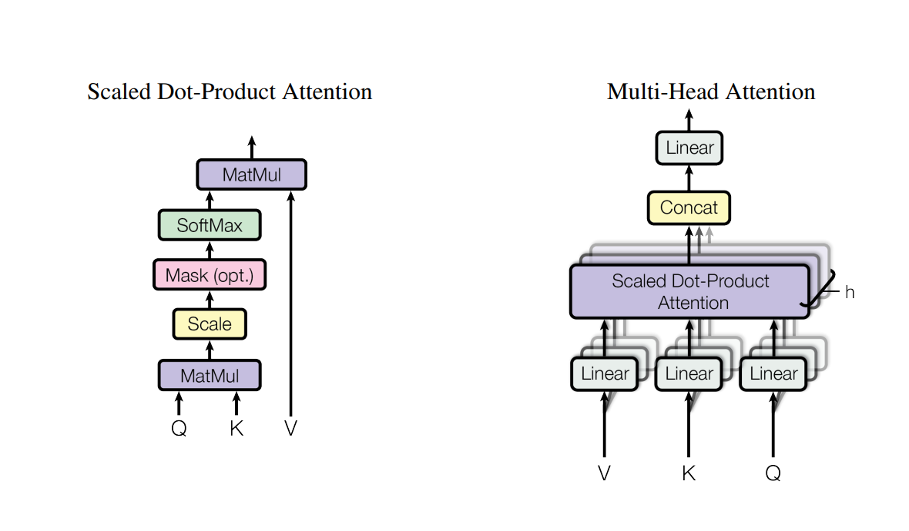
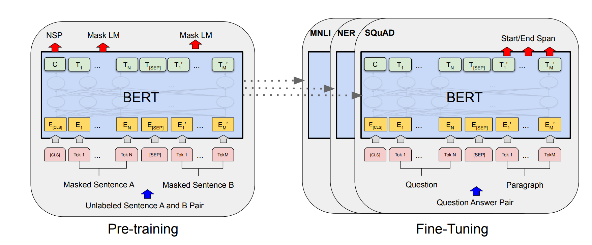

# Transformer-Readiing-Report🎉
# Transformer的论文阅读报告与代码理解🎉
## 🎄本项目包含对多篇Transformer论文及其衍生文章的论文精读报告及对代码的理解

## 文档结构：
```
Transformer-Reading-Report/
|—— Attention is all you need/ |—— Attention is all you need report.md #阅读报告
                               |—— images
                               |—— demo.py

|—— Bert/ |—— Bert report.md #阅读报告
          |—— images
          |—— demo.py

|—— VIT/  |—— VIT report.md #阅读报告
          |—— images
          |—— demo.py

|—— swintransformer |—— swintransformer.report # 阅读报告
                    |—— images
                    |—— demo.py

|—— README.md   #简介与链接
```
## 各个分项目重点内容：
### 包含链接与核心概念图，具体段落与补充知识请见论文阅读报告，实现复现后续补充
-----
### （一）：Attention is all you need
#### 原论文链接：[Attention is all you need](https://arxiv.org/abs/1706.03762)
#### 借鉴视频讲解：[跟李沐学AI：attention](https://www.bilibili.com/video/BV1pu411o7BE/?spm_id_from=333.999.0.0&vd_source=6e22f74cbbb0cdf9444235d6ad11aabf)
#### 论文阅读报告：[Attention is all you need report](https://github.com/Baiyouawa/Transformer-Reading-Report/blob/main/Attention%20is%20all%20you%20need/Attention%20is%20all%20you%20need%20report.md)

**在过去的主流序列传导模型，主要是基于CNN或RNN开展的。**

**在RNN中（LSTM；GRU）等被认为是先进的方法，但由于其具有时序性，这种固有的顺序性限制了并行化，当输入的序列较长的时候，在计算效率和内存上存在很大限制，即便我们通过因子化技巧和条件计算等进行优化。**

**在使用CNN作为基础构建块的模型中，当输入与输出位置距离增加，所需要的操作数就随着位置之间距离增加而增长，也就导致学习远距离之间的依赖关系更加困难。**

**因此提出了完全基于注意力的transformer模型**

#### 核心图：
<table>
  <tr>
    <td></td>
    <td></td>
  </tr>
</table>

**左图是transformer的模型框架，右图为注意力机制**

**阶段一：**

**编码器**：首先输入进入Embedding嵌入层，将原始的输入转化为维度d为512的向量表示，这里的embedding内的权重×根号d，embedding学习后的向量维度大但是值小，需要扩大使得与位置编码相加两者等权。

随后对生成的向量与位置编码直接相加（因为我们输出的信息是value的加权和，并不具有时序性），这样使得向量信息既包含内容信息，也包含位置信息。

**解码器：** 解码器的输出再次作为输入进入解码器嵌入层进行类似的操作。

**阶段二**

**编码器：** 我们的输入序列经过三个线性变换形成QKV，随后通过线性层分解成多头进行点积注意力计算，多头输出后进行拼接形成最终输出结果（此时相当于做了一次汇聚）使得词语包含了我们想要的依赖关系的信息。随后通过残差连接进入layerNorm（层归一化）；

**解码器：** 类似的进行残差连接和多头注意力计算，这里存在掩码（目的是再训练时避免使用未来信息，所以通过设置后续非常小的value，使得我们的softmax函数后权重 为0）

#####  阶段三：

**编码器：** 经过层归一化后的输出通过残差连接进入MLP，再次实现将信息投影到我们更希望的语义空间中。再次通过归一化后作为Q，K进入解码器。

**解码器：** 上一步解码器输出作为V，与Q，K一起进行多头注意力计算，层归一化和线性层后实现输出，经过多层编码器-解码器架构后得到最终输出。

#### Demo文件：
-----
###  (二）：Bert
#### 原论文链接：[Bert](https://arxiv.org/abs/1810.04805)
#### 借鉴视频链接：[李沐学AI：bert](https://www.bilibili.com/video/BV1PL411M7eQ?vd_source=88664659bdda4409e78f614f5f213ce8)
#### 论文阅读报告：[论文阅读报告](https://github.com/Baiyouawa/Transformer-Reading-Report/blob/main/Bert/Bert%20report.md)
**Bert是一种用于语言理解预训练的双向的transformer模型，他可以联系左右上下文，不同于Elmo，无需再对特定任务时进行任务框架的大量修改，而是联系上下文的微调方式，进而提升了在词级，句子级理解。**
#### 核心图：
<table>
  <tr>
    <td></td>
    <td></td>
  </tr>
</table>

 ##### 首先在右图我们可以看到输入操作：
##### 在Bert当中我们的输入token序列，可以是单个句子也可以是两个句子打包在一起。每个序列的第一个token是一个特殊的分类【CLS】，然后我们通过两种方式区别句子，首先我们用一个特殊的token【SEP】将他们分开，其次我们为每个token添加一个学习到的嵌入，来表示是句子AorB。也就是说，输入是由相应的token+段落嵌入+位置嵌入求和构建的。
  ##### 然后在左图我们可以看到模型架构：
##### Bert的模型核心就是基于原始实现的多层双向Transformer**编码器**，具体细节在上面可以看到。
demo文件：[demo](https://github.com/Baiyouawa/Transformer-Reading-Report/blob/main/Bert/demo.py)

-----
### (三）：VIT
#### 原论文链接：[VIT](https://arxiv.org/pdf/2010.11929)
#### 借鉴视频链接：[李沐学AI](https://www.bilibili.com/video/BV15P4y137jb/?spm_id_from=333.999.0.0&vd_source=6e22f74cbbb0cdf9444235d6ad11aabf)
#### 论文阅读报告：[论文阅读报告](https://github.com/Baiyouawa/Transformer-Reading-Report/blob/main/VIT/VIT%20report.md)

#### 核心图：
 <td></td>

 


