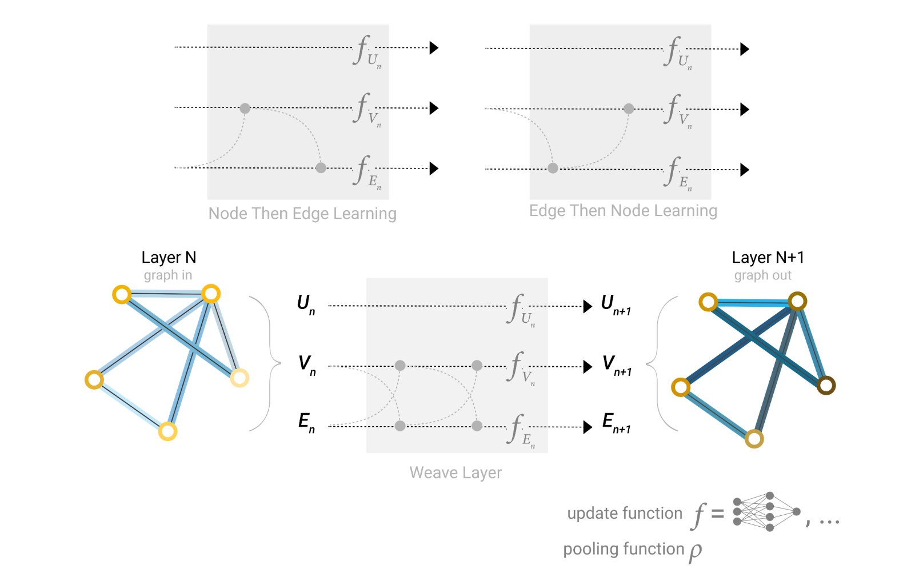

# Transformer-Reading-Reports🎉
# Transformer的论文阅读报告与代码理解🎉
## 🎄本项目包含对多篇Transformer论文及其衍生文章的论文精读报告及对代码的理解

## 文档结构：
```
Transformer-Reading-Report/
|—— Attention is all you need/ |—— Attention is all you need report.md #阅读报告
                               |—— images
                               |—— demo.py

|—— Bert/ |—— Bert report.md #阅读报告
          |—— images
          |—— demo.py

|—— VIT/  |—— VIT report.md #阅读报告
          |—— images
          |—— demo.py

|—— swintransformer |—— swintransformer.report # 阅读报告
                    |—— images
                    |—— demo.py

|—— GNN |—— GNN&Gragh.report #阅读报告
未完结 |—— images

|—— Multimodal |—— ViLT&conclusion.report #VITL&串讲阅读报告
               |—— demo.py

|—— conclude（PPT） |—— PPT #补充PPT文件

|—— README.md   #简介与链接
```
## 各个分项目重点内容：
### 包含链接与核心概念图，具体段落与补充知识请见论文阅读报告，实现复现后续补充
-----
### （一）：Attention is all you need
#### 原论文链接：[Attention is all you need](https://arxiv.org/abs/1706.03762)
#### 借鉴视频讲解：[跟李沐学AI：attention](https://www.bilibili.com/video/BV1pu411o7BE/?spm_id_from=333.999.0.0&vd_source=6e22f74cbbb0cdf9444235d6ad11aabf)
#### 论文阅读报告：[Attention is all you need report](https://github.com/Baiyouawa/Transformer-Reading-Report/blob/main/Attention%20is%20all%20you%20need/Attention%20is%20all%20you%20need%20report.md)
#### demo代码：[transformer](https://github.com/Baiyouawa/Transformer-Reading-Report/blob/main/Attention%20is%20all%20you%20need/demo.py)
**在过去的主流序列传导模型，主要是基于CNN或RNN开展的。**

**在RNN中（LSTM；GRU）等被认为是先进的方法，但由于其具有时序性，这种固有的顺序性限制了并行化，当输入的序列较长的时候，在计算效率和内存上存在很大限制，即便我们通过因子化技巧和条件计算等进行优化。**

**在使用CNN作为基础构建块的模型中，当输入与输出位置距离增加，所需要的操作数就随着位置之间距离增加而增长，也就导致学习远距离之间的依赖关系更加困难。**

**因此提出了完全基于注意力的transformer模型**

#### 核心图：
<table>
  <tr>
    <td></td>
    <td></td>
  </tr>
</table>

**左图是transformer的模型框架，右图为注意力机制**

**阶段一：**

**编码器**：首先输入进入Embedding嵌入层，将原始的输入转化为维度d为512的向量表示，这里的embedding内的权重×根号d，embedding学习后的向量维度大但是值小，需要扩大使得与位置编码相加两者等权。

随后对生成的向量与位置编码直接相加（因为我们输出的信息是value的加权和，并不具有时序性），这样使得向量信息既包含内容信息，也包含位置信息。

**解码器：** 解码器的输出再次作为输入进入解码器嵌入层进行类似的操作。

**阶段二**

**编码器：** 我们的输入序列经过三个线性变换形成QKV，随后通过线性层分解成多头进行点积注意力计算，多头输出后进行拼接形成最终输出结果（此时相当于做了一次汇聚）使得词语包含了我们想要的依赖关系的信息。随后通过残差连接进入layerNorm（层归一化）；

**解码器：** 类似的进行残差连接和多头注意力计算，这里存在掩码（目的是再训练时避免使用未来信息，所以通过设置后续非常小的value，使得我们的softmax函数后权重 为0）

#####  阶段三：

**编码器：** 经过层归一化后的输出通过残差连接进入MLP，再次实现将信息投影到我们更希望的语义空间中。再次通过归一化后作为Q，K进入解码器。

**解码器：** 上一步解码器输出作为V，与Q，K一起进行多头注意力计算，层归一化和线性层后实现输出，经过多层编码器-解码器架构后得到最终输出。

-----
###  (二）：Bert
#### 原论文链接：[Bert](https://arxiv.org/abs/1810.04805)
#### 借鉴视频链接：[李沐学AI：bert](https://www.bilibili.com/video/BV1PL411M7eQ?vd_source=88664659bdda4409e78f614f5f213ce8)
#### 论文阅读报告：[论文阅读报告](https://github.com/Baiyouawa/Transformer-Reading-Report/blob/main/Bert/Bert%20report.md)
#### demo文件： [bert](https://github.com/Baiyouawa/Transformer-Reading-Report/blob/main/Bert/demo.py)

**Bert是一种用于语言理解预训练的双向的transformer模型，他可以联系左右上下文，不同于Elmo，无需再对特定任务时进行任务框架的大量修改，而是联系上下文的微调方式，进而提升了在词级，句子级理解。**
#### 核心图：
<table>
  <tr>
    <td></td>
    <td></td>
  </tr>
</table>

 ##### 首先在右图我们可以看到输入操作：
##### 在Bert当中我们的输入token序列，可以是单个句子也可以是两个句子打包在一起。每个序列的第一个token是一个特殊的分类【CLS】，然后我们通过两种方式区别句子，首先我们用一个特殊的token【SEP】将他们分开，其次我们为每个token添加一个学习到的嵌入，来表示是句子AorB。也就是说，输入是由相应的token+段落嵌入+位置嵌入求和构建的。
  ##### 然后在左图我们可以看到模型架构：
##### Bert的模型核心就是基于原始实现的多层双向Transformer**编码器**，具体细节在上面可以看到。


-----
### (三）：VIT
#### 原论文链接：[VIT](https://arxiv.org/pdf/2010.11929)
#### 借鉴视频链接：[李沐学AI](https://www.bilibili.com/video/BV15P4y137jb/?spm_id_from=333.999.0.0&vd_source=6e22f74cbbb0cdf9444235d6ad11aabf)
#### 论文阅读报告：[论文阅读报告](https://github.com/Baiyouawa/Transformer-Reading-Report/blob/main/VIT/VIT%20report.md)
#### demo文件：[VIT](https://github.com/Baiyouawa/Transformer-Reading-Report/blob/main/VIT/demo.py)

##### 在NLP领域中transformer架构已经作为实际标准，但是在CV领域有限，尽管在前人实验中，有将注意力机制与卷积神经网络结合使用的，要么就是用于替换CNN中的某些组件。但是在VIT中，我们相当于直接将transformer进行应用于图像，拆分成补丁。但由于transformer框架没有过多的归纳偏置（在MLP上有），所以在中小型数据集上效果并不如ResNet，但是在大型数据集上有更加优秀的效果。并且随着模型参数增长没有出现过拟合的现象。

#### 核心图：
 <td></td>

**首先观察输入：**
输入为一个图片（224×224×3）（长宽RGB），我们将它打成16×16的patch，token就是16×16×3的维度（共计196个像素块）经过线性投影层做矩阵乘法得196×768+1×768（class）然后与位置编码通过sum方式进行更新。

**进入编码器：**
进入多头自注意力，拆分成KQV，同时又因为是多头自注意力；KQV变成了197×64，再经过拼接变为768维度，经过layernorm后进入MLP放大四倍，再投影回去。

最后：

- 全局信息聚合: 当输入序列（包括class token和patch tokens）通过多层Transformer编码器时，class token在每一层中与其他patch tokens交互并更新其表示。这种交互使得class token逐渐累积和整合整个图像的全局信息。

- 分类任务的特征图: 经过所有编码器层的处理后，class token最终包含了整个图像的全局特征。因为分类任务需要的是全局信息，class token成为了最合适的输出作为最终的分类特征图。

因此，class token 从输入阶段一直存在于所有编码器层，并在最后一层将其作为最终输出用于分类任务的决策。这意味着在每一层，class token都在继续累积来自其他patch tokens的信息，最终在输出时聚合了整个输入序列的全局信息。


-----

### （四）：Swintransformer：
#### 原论文链接：[Swin Transformer](https://arxiv.org/pdf/2103.14030)
#### 借鉴视频链接：[李沐学AI](https://www.bilibili.com/video/BV13L4y1475U?vd_source=88664659bdda4409e78f614f5f213ce8)
#### 论文阅读报告：[论文阅读报告](https://github.com/Baiyouawa/Transformer-Reading-Report/blob/main/swintransformer/SwinTransformer%20report.md)
#### demo文件：[Swin transformer](https://github.com/Baiyouawa/Transformer-Reading-Reports/blob/main/swintransformer/swin%20transformer.py)

Swin transformer就是让VIT也能像CNN一样分成很多block，形成层级式的提取，具有多尺度的概念。
通过移动窗口将自注意力计算限制在不重叠的局部窗口中，提高效率的同时，允许跨窗口通信连接。
这样使得再处理图像和视频时非常重要，在不同尺度（分辨率）上提取特征，捕捉图像中不同层次的细节和信息
**高分辨率：** 可以捕捉到图像的细节信息，比如纹理和边缘
**低分辨率：** 捕捉图像的整体结构和全局信息，进而提升鲁棒性。

#### 核心图：
<table>
  <tr>
    <td></td>
    <td></td>
  </tr>
</table>

#### 流程：
**首先我们的图片是224×224×3的维度，经过Patch partition（4×4）后，图片尺度变为56×56×48（48 = 4×4×3），接下来经过embedding层，我们设定超参数为C（96），这样经过全连接层，48变为96（56×56×96）；前面的参数拉直变为3136序列长度，96是token。**
**但是3136序列长度太长了，所以我们引入了窗口计算，每个窗口有7×7=49个patch；经过第一个部分Block后，得到56×56×96，随后进行Patch Merging以便获得多尺寸信息，类似于CNN池化。**
**随后将邻近的小Patch合成为一个大Patch，下采样两倍，所以隔一个点选一个，形成后为了将通道数仅仅扩大一倍，我们做一个1×1方向上卷积，通道数重新变为2，经过全局池化后得出总体。**

这种基于窗口的注意力计算相比于正常的计算减少了很大复杂度。

<table>
  <tr>
    <td></td>
    <td></td>
  </tr>
</table>

#### 窗口计算&掩码：
在经过移动窗口之后，会出现每个窗口Patch个数不同的情况，这也就导致我们不能转化为一个Batch进行计算，如果补充0（在外围）又会使得计算复杂度增加，所以我们采用掩码的方式（拼图）
**通过这种循环移位，分割填补。有的窗口应该进行注意力计算，同样，对于有的窗口中的其他部分，不应该进行窗口注意力计算，所以我们采取掩码方式，在矩阵乘法时，对于输出部分不需要的部分设定为较小的负数吗，进而在softmax操作之后，我们可以实现掩码。**


-----
### （五）：GNN&Gragh：(未完结）
#### 博客链接：[introduction](https://distill.pub/2021/gnn-intro/)
#### 原论文2链接：[GNN](https://arxiv.org/pdf/2310.11829)
#### 视频讲解链接：[李沐学AI](https://www.bilibili.com/video/BV1iT4y1d7zP?vd_source=88664659bdda4409e78f614f5f213ce8)
#### 论文阅读报告：[GNN](https://github.com/Baiyouawa/Transformer-Reading-Reports/blob/main/GNN/%E5%9B%BE%E7%A5%9E%E7%BB%8F%E7%BD%91%E7%BB%9C%EF%BC%9A.md)

图是一种常见的数据结构，它由顶点，边，整体图三部分构成，他可以表示很多信息（文本，图片，复杂社交网络等）

#### 核心图：
<table>
  <tr>
    <td></td>
    <td></td>
  </tr>
</table>

**GNN是对图上所有属性（点，边，全局）进行可以优化的变换，同时保持住图的对称信息。会对图中点，边等的向量进行变换，但不会对边连接的哪些顶点等信息不会改变。
GFMs是图基础模型，主要分为三大类：**
**1. GNN-based Models（基于GNN的模型）**
这一类模型以图神经网络为核心架构，重点关注图结构数据的处理和学习。分为以下几个部分：    

Backbone Architectures（骨干架构）：    


    Message Passing-based（基于消息传递）： 这是传统的GNN架构，依赖图的邻接矩阵，信息在图的节点之间进行传递和聚合。这种方法在局部信息传播方面表现良好，但可能在捕获全局信息方面存在不足。    
    
    
    Graph Transformer-based（基于图Transformer）： 相较于传统的消息传递机制，图Transformer通过全连接自注意力机制在图中每一对节点之间进行信息传递，能够更好地捕获长程依赖关系和全局信息。    
    
    
Pre-training（预训练）：    

    Contrastive Methods（对比方法）： 这种方法通过最大化不同图视角间的互信息，使得模型可以学习到图的稳健表示，通常采用相同或不同尺度之间的对比。    
    
    Generative Methods（生成方法）： 生成方法侧重于重建图的特定部分，或者预测图的属性，通过这种方式来学习图的结构和语义信息。    
    
Adaptation（适应）：    

    Fine-Tuning（微调）： 将预训练的模型在具体下游任务上进行微调，使得模型能够适应特定的任务需求。    
    
    Prompt-Tuning（提示调优）： 通过特定提示信息来调优模型，使其能够快速适应新任务，减少对大量标注数据的依赖。    
    
**2. LLM-based Models（基于LLM的模型）**    

这类模型以大规模语言模型为基础，关注如何将图数据转化为适合语言模型处理的形式。分为以下部分：    

Backbone Architectures（骨干架构）：    
 
    Graph-to-Token（图到标记）： 通过将图中的节点或边信息编码为Token，使得图数据能够输入到LLM中进行处理。    
    
    Graph-to-Text（图到文本）： 通过将图的结构信息转化为文本形式，然后利用语言模型来进行理解和生成。    
    
Pre-training（预训练）：    

    Language Modelling（语言建模）： 以语言模型为基础，通过大量未标注的文本数据进行预训练，使得模型能够捕捉语言中的一般语义信息。    
    
    Masked Language Modelling（掩码语言建模）： 类似于BERT模型，通过对部分文本进行掩码并让模型预测这些掩码内容，从而使模型能够理解上下文。    
    
Adaptation（适应）：    

    Manual Prompting（手动提示）： 通过手动设计的提示词来引导模型的输出，使其适应不同任务。    
    
    Automatic Prompting（自动提示）： 自动生成合适的提示词，减少人工干预，提升模型在不同任务上的适应性。
    
**3. GNN+LLM-based Models（GNN+LLM结合的模型）**

这类模型尝试将图神经网络与大规模语言模型的优势结合，利用两者的互补特性来提升图数据处理的能力。分为以下部分：

Backbone Architectures（骨干架构）：

    GNN-centric（以GNN为中心）： 以GNN为主要架构，结合语言模型来辅助处理语言或文本相关的信息。
    
    Symmetric（对称式）： GNN与LLM并重，模型架构中平衡两者的贡献，使得模型能够同时处理图结构和文本信息。
    
    LLM-centric（以LLM为中心）： 以语言模型为主要架构，结合GNN来处理图结构信息。
    
Pre-training（预训练）：

    GNN or LLM-based（基于GNN或LLM）： 采用GNN或LLM的预训练方法，根据任务需求选择合适的预训练策略。
    
    Alignment-based（对齐方法）： 通过对齐GNN和LLM之间的表示，使两者能够更好地协同工作。
    
Adaptation（适应）：

    Fine-Tuning（微调）： 通过对结合后的模型进行微调，提升其在特定任务上的表现。
    
    Prompt-Tuning（提示调优）： 结合GNN与LLM的提示信息，通过调优使模型适应更多样化的任务场景。
    
对比与总结

    处理对象的不同： 基于GNN的模型专注于图结构数据，而基于LLM的模型则将图数据转换为文本或Token形式处理。GNN+LLM结合的模型试图整合两者的优势，处理更加复杂的图-语言任务。
    
    架构设计： GNN-based模型侧重于图结构的特定学习机制，而LLM-based模型侧重于自然语言处理的任务需求。GNN+LLM结合模型则尝试在二者之间找到最佳平衡点。
    
    预训练与适应方式： GNN-based模型通常利用对比学习和生成方法来捕获图的语义信息，而LLM-based模型则更依赖语言建模策略。结合模型通过对齐两者表示或微调来提升性能。
    

-----
### （六）：Multimoda：
#### 论文链接：[ViTL]()
#### 视频讲解1：[]()
#### 视频讲解2：[]()
#### 论文阅读报告：[]()
#### demo文件：[]()

#### 核心图：

-----
