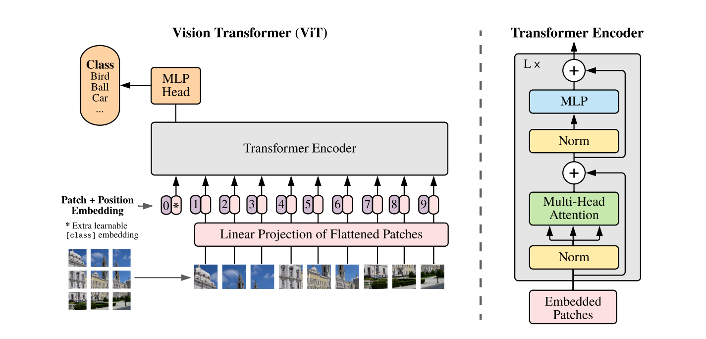

## VIT report 

### 论文链接：[VIT](https://arxiv.org/pdf/2010.11929)

### 视频讲解：[视频讲解](https://www.bilibili.com/video/BV15P4y137jb/?spm_id_from=333.999.0.0&vd_source=6e22f74cbbb0cdf9444235d6ad11aabf)

### 一：论文：一张图片等价于16*16的单词

#### 1.摘要：

虽然Transformer架构已经成为自然语言处理任务的实际标准，但其在计算机视觉 （CV）中的应用仍然有限。在视觉领域，注意力机制要么与卷积网络结合使用，**要么用于替换卷积网络的某些组件**，同时**保持其整体结构不变**。我们展示了这种对CNN的依赖并非必要，直接将纯Transformer应用于图像补丁序列也可以在**图像分类任务**中表现得非常好。当在大量数据上进行预训练并转移到多个中型或小型图像识别基准（如ImageNet、CIFAR-100、VTAB等）时，Vision Transformer（ViT）相较于最先进的卷积网络取得了优异的结果，同时需要显著更少的计算资源来训练。

#### 2.引言：

基于自注意力的架构，尤其是Transformers（Vaswani等，2017年），已经成为自然语言处理（NLP）领域的首选模型。主要的方法是在**大规模文本语料库上进行预训练**，然后在**较小的特定任务数据集上进行微调**（Devlin等，2019年）。得益于Transformers的计算效率和可扩展性，训练超过1000亿参数的模型(GPT3)成为可能（Brown等，2020年；Lepikhin等，2020年）。**随着模型和数据集的增长，性能仍然没有饱和的迹象**。

然而，在计算机视觉领域，卷积架构仍然占据主导地位（LeCun等，1989年；Krizhevsky等，2012年；He等，2016年）。受NLP成功的启发，多项研究尝试将**CNN样的架构与自注意力相结合**（Wang等，2018年；Carion等，2020年），有些甚至**完全替换卷积**（Ramachandran等，2019年；Wang等，2020a）。尽管后者的模型在理论上效率很高，但由于使用了特定的注意力模式，它们尚未在现代硬件加速器上有效扩展。因此，在大规模图像识别中，经典的ResNet类架构仍然是最先进的（Mahajan等，2018年；Xie等，2020年；Kolesnikov等，2020年）。

受Transformer在NLP中扩展成功的启发，**我们尝试将标准的Transformer直接应用于图像，并尽可能少地进行修改**。为此，**我们将图像拆分成补丁，并将这些补丁的线性嵌入序列**作为输入提供给Transformer。图像补丁被视为NLP应用中的标记（词语）。我们在**监督学习**的情况下训练模型进行图像分类。

当在**中型数据集**（如ImageNet）上训练且没有强正则化时，这些模型的准确率略低于同等规模的ResNet。这种看似令人沮丧的结果是可以预料的：Transformers**缺乏CNN固有的一些归纳偏置**【1】，如**平移等变性和局部性**，因此在数据量不足的情况下泛化效果不好。

然而，如果在**更大规模的数据集**（1400万-3亿张图像）上训练模型，情况会有所改变。我们发现大规模训练优于归纳偏置。当在足够规模的数据集上进行预训练并转移到数据较少的任务上时，我们的Vision Transformer（ViT）取得了优异的结果。当在公开的ImageNet-21k数据集或内部的JFT-300M数据集上进行预训练时，ViT在多个图像识别基准上达到了或超越了最先进水平。具体而言，最佳模型在ImageNet上的准确率达到88.55%，在ImageNet-ReaL上的准确率达到90.72%，在CIFAR-100上的准确率达到94.55%，在包含19个任务的VTAB套件上的准确率达到77.63%。

**解读：很多时候一味的扩大数据集训练集并不一定就会得到很好的模型效果。有可能会出现过拟合【2】的现象，但是在Transformer上目前没有发现这个瓶颈。在transformer里做CV的话,输入的一个个像素点互相关系,但是Transformer在硬件上支持的序列长度也就是成百上千，bert就是512，在视觉中，如果我们简单的想法把224*224的图片拉直，50176个像素点-那么序列长度就过于复杂。**

**可以看到自注意力早已在视觉领域有所使用，甚至尝试过完全使用注意力替代。第一种是：用中间的特征图代替图片来减少（序列长度）复杂度。孤立自注意力：仅仅使用图片的小窗口；轴注意力：在高度和宽度上做自注意力,把2d矩阵转化为两个1d向量。虽然说在理论上可以，但是在硬件上不能支持加速，不能形成成熟的大模型，仍然是传统的残差网络效果比较好。重点在于VIT将NLP和CV方法类似起来。**

【1】：**归纳偏置**：归纳偏置是指在机器学习过程中，模型在学习目标函数时所遵循的一组假设。这些假设帮助模型在训练数据之外进行预测，即如何从有限的训练数据中推断出一般性的规律。

- 归纳偏置决定了模型的学习能力和泛化能力。不同的模型有不同的归纳偏置。
- 对于卷积神经网络（CNN），典型的归纳偏置包括局部性和平移不变性。局部性假设图像的局部像素有相关性，而平移不变性假设对象在图像中的位置不影响其识别结果。
- 归纳偏置有助于在训练数据不足或噪声较多的情况下，仍能进行有效的学习和预测。

**示例：**

- 在自然语言处理中，序列模型（如RNN和Transformer）假设数据具有序列依赖性，这就是一种归纳偏置。
- 在计算机视觉中，CNN利用图像的空间结构，即像素的局部关联性，这也是一种归纳偏置

【2】：**过拟合**：过拟合是指模型在训练数据上表现非常好，但在测试数据或未见过的数据上表现不佳。过拟合的模型对训练数据中的噪声或特定模式过于敏感，无法有效泛化到新数据。

**原因：**

- 模型复杂度过高：参数过多的模型能够记住训练数据的细节和噪声，而不是学习到一般性的规律。
- 训练数据不足：数据量过少或数据集不够多样，导致模型无法学习到普遍适用的特征。
- 缺乏正则化：没有使用足够的正则化技术（如L1/L2正则化、Dropout等）来限制模型的复杂度。

------

#### 3.结论：

我们已经探索了将Transformer直接应用于**图像识别**。与以往在计算机视觉中使用自注意力的方法不同，我们并未在架构中引入除初始图像补丁提取步骤外的特定于图像的归纳偏置。相反，我们将图像解释为一系列补丁，并使用在NLP中常用的标准Transformer编码器进行处理。这种简单但可扩展的策略在结合大规模数据集预训练时表现出色。因此，Vision Transformer在许多图像分类数据集上匹配或超越了最先进水平，同时预训练成本相对较低。

尽管这些初步结果令人鼓舞，但仍有许多挑战需要解决。其中一个挑战是将ViT应用于其他计算机视觉任务，如**目标检测和分割**。我们与Carion等人（2020年）的结果表明，这种方法具有潜力。另一个挑战是继续探索**自监督预训练方法【3】**。我们的初步实验表明，自监督预训练有所改进，但与大规模监督预训练相比仍存在较大差距。最后，进一步扩展ViT可能会带来性能提升。****

【3】：**自监督预训练方法**：是一种机器学习技术，它利用大量未标注数据进行模型训练，通过设计特定的预训练任务，使模型能够从数据中自我生成监督信号。这种方法尤其在自然语言处理（NLP）和计算机视觉领域取得了显著的成功。

##### 1. 自监督预训练的特点

- **无需人工标注:** 自监督预训练通过从数据中自动生成训练目标，无需人工标注大规模的数据集，从而大大降低了数据标注的成本。
- **丰富的表示能力:** 自监督预训练能够捕捉到数据的丰富信息，使得模型在下游任务中表现出色。

##### 2. 常见的自监督预训练任务

- **Masked Language Model (MLM):** 例如在BERT模型中，随机掩盖一部分输入词汇，然后让模型预测被掩盖的词汇。这样，模型学习到了上下文的双向信息。
- **Next Sentence Prediction (NSP):** 例如在BERT中，通过预测两个句子是否相邻来帮助模型理解句子之间的关系。
- **Contrastive Learning:** 在计算机视觉中，通过对比不同视角的图片，使模型学会识别相同物体的不同表现形式。

##### 3. 自监督预训练的应用

- **自然语言处理:** BERT、GPT等模型使用自监督预训练方法，在大规模未标注文本上进行预训练，然后在具体的下游任务上进行微调。
- **计算机视觉:** 自监督预训练方法也被应用于图像分类、物体检测等任务，通过设计合适的预训练任务，模型能够学习到图像的丰富表示。

##### 4. 自监督预训练的优势

- **数据高效利用:** 自监督预训练可以充分利用大量未标注数据，使模型获得更强的泛化能力。
- **任务适应性强:** 通过预训练，模型在面对不同的下游任务时，只需要进行少量微调即可获得优异的性能。

#### 4.先前工作：

Transformer由Vaswani等人（2017年）提出用于机器翻译，并且自此成为许多NLP任务的最先进方法。大型基于Transformer的模型通常在大规模语料库上进行预训练，然后针对特定任务进行微调：BERT（Devlin等人，2019年）使用去噪自监督预训练任务，而GPT系列工作则使用语言建模作为其预训练任务（Radford等人，2018年；2019年；Brown等人，2020年）。

将自注意力机制直接应用于图像时，每个像素需要关注每个其他像素，随着**像素数量的平方而增加**的计算成本使得这种方法在实际输入尺寸上不可扩展。因此，为了在图像处理中应用Transformers，过去尝试了几种**近似**方法。Parmar等人（2018年）仅在每个查询像素的局部邻域内应用自注意力，而不是在全局范围内。这样的局部多头点积自注意力块可以完全替代卷积（Hu等人，2019年；Ramachandran等人，2019年；Zhao等人，2020年）。在另一种工作中，Sparse Transformers（Child等人，2019年）采用了可扩展的全局自注意力近似方法，使其能够应用于图像。另一种扩展注意力的方法是将其应用于不同大小的块中（Weissenborn等人，2019年），在极端情况下仅沿个别轴应用（Ho等人，2019年；Wang等人，2020a）。**许多这些专门的注意力架构在计算机视觉任务中展示了有前途的结果，但在硬件加速器上高效实现需要复杂的工程设计**。

与我们最相关的模型是Cordonnier等人（2020年）的工作，他们从输入图像中提取2×2大小的补丁，并在其上应用全自注意力。这个模型与ViT非常相似，但我们的工作进一步展示了大规模预训练使得原生Transformers在性能上与最先进的CNN竞争，甚至更好。此外，Cordonnier等人（2020年）使用2×2像素的小补丁尺寸，这使得模型仅适用于低分辨率图像，而我们也处理中等分辨率图像。

还有很多研究兴趣在于将卷积神经网络（CNN）与自注意力形式相结合，例如通过增强特征图进行图像分类（Bello等人，2019年）或通过自注意力进一步处理CNN的输出，如用于目标检测（Hu等人，2018年；Carion等人，2020年）、视频处理（Wang等人，2018年；Sun等人，2019年）、图像分类（Wu等人，2020年）、无监督目标发现（Locatello等人，2020年），或统一的文本-视觉任务（Chen等人，2020c；Lu等人，2019年；Li等人，2019年）（多模态）。

另一种最近相关的模型是image GPT（iGPT）（Chen等人，2020a），它在降低图像分辨率和颜色空间后将Transformers应用于图像像素。该模型以无监督方式作为生成模型进行训练，然后可以对所得的表示进行微调或线性探测以进行分类性能评估，在ImageNet上达到72%的最高准确率。

我们的工作增加了探索比标准ImageNet数据集更大规模图像识别的论文集合。使用额外的数据源可以在标准基准上取得最先进的结果（Mahajan等人，2018年；Touvron等人，2019年；Xie等人，2020年）。此外，Sun等人（2017年）研究了CNN性能如何随数据集大小扩展，而Kolesnikov等人（2020年）和Djolonga等人（2020年）则对从大规模数据集（如ImageNet-21k和JFT-300M）进行CNN迁移学习进行了实证探索。我们也关注这两个数据集，但训练的是Transformers，而不是先前工作中使用的基于ResNet的模型。

**解读：如果将每一个像素点当成一个元素，平方复杂度计算后较高。所以我们采用近似的方法，不使用整张图，而是采取邻域小窗口，或者是轴注意力等等方法。**

#### 5.模型：

在模型设计中，我们尽可能紧密地遵循原始Transformer（Vaswani等人，2017年）。这种有意保持简单的设置的一个优势是，可以几乎不做改动地使用可扩展的NLP Transformer架构及其高效实现。

#### （1）：VIT：

#### **（1）：图片预处理：**

**假设我们有一个图片，维度大小是224×224×3（长宽，RGB通道），如果我们使用16×16的patchsize，token = 16×16×3的维度（196个像素块),线性投影层就是全连接层（768（patch）×768（D））；输入token矩阵196×768与全连接层矩阵做乘法，得到196×768（x×E）+1特殊token（共计197×768）输入序列。Transformer本身对顺序不敏感。位置嵌入的维度与token相同，即 
197×768.然后通过sum的方式得出更新维度。**

#### （2）：进入Encoder：

**进入多头自注意力，拆分成三份KQV，同时又因为是多头自注意力（12个头）；KQV变成了197×64，12个头拼接起来再次变成768维度。经过一层layernorm后进入MLP（放大四倍）197×3012；再投影回197×768.不断叠加得到输出。**

这就是整个前向传播过程；

**sum与concatenation的区别：**

##### 1. sum

**sum** 是将两个或多个向量进行逐元素相加，结果是一个新的向量，其维度与输入向量相同。

**示例：** 假设有两个向量：

- A = [1, 2, 3]
- B = [4, 5, 6]

**sum** 操作的结果是：

- C = A + B = [1+4, 2+5, 3+6] = [5, 7, 9]

**特点：**

- **维度保持不变:** sum 操作后的结果向量维度与原向量相同。
- **信息融合:** 通过逐元素相加，可以将多个向量的信息融合在一个向量中。
- **计算简单:** 相对计算效率较高，适用于需要保持维度一致的场景。

##### 2. concatenation

**concatenation** 是将两个或多个向量按维度进行拼接，结果是一个新的向量，其维度是所有输入向量的维度之和。

**示例：** 假设有两个向量：

- A = [1, 2, 3]
- B = [4, 5, 6]

**concatenation** 操作的结果是：

- C = [A, B] = [1, 2, 3, 4, 5, 6]

**特点：**

- **维度增加:** concatenation 操作后的结果向量维度是所有输入向量维度的总和。
- **信息保留:** 可以保留所有输入向量的完整信息，不进行信息融合。
- **计算灵活:** 适用于需要保留不同特征或输入信息的场景，但计算复杂度较高。

#### （1）：VIT：

模型概述如图1所示。标准的Transformer接收1D的token嵌入序列作为输入。为了处理2D图像，我们将图像 

$$
x ∈ R^{H\times{W}\times{C}}
$$

重新塑造为一个扁平化的2D补丁序列 

$$
x ∈R^{N\times{(P^2\cdot{C})}}
$$

其中 (H,W)是原始图像的分辨率， C是通道数，(P,P) 是每个图像补丁的分辨率，且 

$$
N= \frac{HW}{P^2}
$$

 是生成的补丁数，也即Transformer的有效输入序列长度。Transformer在所有层中使用恒定的潜在向量大小 D，所以我们将补丁扁平化并通过可训练的线性投影映射到 D 维（公式1）。我们将这个投影的输出称为补丁嵌入。

类似于BERT的[class] token，我们在嵌入补丁序列之前添加一个可学习的嵌入

$$
Z_0^0 = x_{class}
$$

其在Transformer编码器输出的状态（ zL0）作为图像表示 y（公式4）。在预训练和微调过程中，都将一个分类头连接到 zL0。分类头在预训练时由一个具有一层隐藏层的MLP实现，在微调时由一个单线性层实现。

为了保留位置信息，我们在补丁嵌入中添加了位置嵌入。我们使用**标准的可学习1D位置嵌入**，因为我们没有观察到使用更高级的2D感知位置嵌入带来显著的性能提升（附录D.4）。生成的嵌入向量序列作为编码器的输入。

Transformer编码器（Vaswani等人，2017年）由交替的多头自注意力（MSA，见附录A）和MLP块（公式2，3）组成。每个块之前应用Layernorm（LN），每个块之后应用残差连接（Wang等人，2019年；Baevski和Auli，2019年）。MLP包含两层并使用GELU非线性激活函数。

具体公式如下： 

$$
z_0 = [x_{class};x_p^1E;x_p^2E……;x_p^NE]+E_{pos},E∈R^{(P^2\cdot{C})\times{D}}\\
z^{l'} = MSA(LN(z^{l-1}))+z^{l-1}，l= 1……L\\z^l = MLP(LN(z^{l'}))+z^{l'},l = 1,……，L\\y = LN(z_0^L)
$$

`class token` 的特征图作为分类任务的输入是因为它在整个 Transformer 层的处理中聚合了全局的信息。具体来说：

1. **全局信息聚合**：在输入阶段，`class token` 与其他 patch 一起进入模型。通过多层 Transformer 操作，每个 token 都与其他 token 进行信息交换和交互，`class token` 可以获取整个输入序列的全局信息。
2. **分类任务的需求**：分类任务需要一个全局的表示来做出最终决策。`class token` 在整个模型的层次结构中不断累积和更新它的表示，最终包含了整个输入的全局特征。因此，使用 `class token` 作为分类的特征图是最合适的。

### 归纳偏置

我们注意到，Vision Transformer比CNN具有**更少的图像特定归纳偏置**。在CNN中，局部性、二维邻域结构和平移等变性被内置在整个模型的每一层中。在ViT中，**只有MLP层**是局部且具有平移等变性的，**而自注意力层是全局的**。二维邻域结构使用得非常少：在**模型的开始阶段通过将图像切割成补丁以及在微调阶段调整不同分辨率图像的位置嵌入**（如下所述）。除此之外，初始化时的位置嵌入不携带关于补丁二维位置的信息，所有补丁之间的空间关系都必须从头学习。

### 混合架构

作为原始图像补丁的替代，输入序列可以由CNN的特征图（LeCun等人，1989年）形成。在这个混合模型中，补丁嵌入投影 E（公式1）应用于从CNN特征图中提取的补丁。一个特殊情况是，补丁的空间尺寸为1x1，这意味着输入序列是通过简单地扁平化特征图的空间维度并投影到Transformer维度获得的。分类输入嵌入和位置嵌入如上所述添加。

#### 微调与更高分辨率

通常，我们会在大数据集上预训练ViT，然后微调至（较小的）下游任务。为此，我们移除预训练的预测头，并附加一个零初始化的 \( D \times K \) 前馈层，其中 \( K \) 是下游任务的类别数。微调时使用比预训练更高的分辨率通常是有益的（Touvron等人，2019；Kolesnikov等人，2020）。在输入更高分辨率的图像时，我们保持补丁大小不变，这导致更大的有效序列长度。Vision Transformer可以处理任意序列长度（在内存限制内），然而，预训练的位置嵌入可能不再有意义。因此，我们根据其在原始图像中的位置对预训练的位置嵌入进行2D插值。注意，这个分辨率调整和补丁提取是手动注入Vision Transformer的唯一关于图像2D结构的归纳偏置。

#### 6.实验：

#### 6.1 实验设置

#### 数据集

为了探索模型的可扩展性，我们使用了 ILSVRC-2012 ImageNet 数据集，它包含 1k 类别和 130 万张图像（下文称之为 ImageNet）。其超集 ImageNet-21k 包含 21k 类别和 1400 万张图像 (Deng et al., 2009)，以及 JFT (Sun et al., 2017) 包含 18k 类别和 3.03 亿张高分辨率图像。我们对预训练数据集进行去重，以确保测试集和下游任务数据集不重叠 (Kolesnikov et al., 2020)。我们将训练好的模型应用到多个基准任务上：使用原始验证标签和清理后的 ReaL 标签 (Beyer et al., 2020) 评估 ImageNet，CIFAR-10/100 (Krizhevsky et al., 2009)，Oxford-IIIT Pets (Parkhi et al., 2012)，和 Oxford Flowers-102 (Nilsback & Zisserman, 2008)。这些数据集的预处理步骤参照了 Kolesnikov et al. (2020) 的方法。

我们还评估了 19 个任务的 VTAB 分类套件 (Zhai et al., 2019b)。VTAB 评估低数据量转移到多种任务的表现，每个任务使用 1000 个训练样本。这些任务分为三类：自然类——如上述任务，Pets、CIFAR 等；专业类——医疗和卫星图像；结构类——需要几何理解的任务如定位。

#### 模型变体

我们基于 BERT (Devlin et al., 2019) 的配置来构建 ViT，如表 1 所示。直接采用了 BERT 的 “Base” 和 “Large” 模型，并增加了更大的 “Huge” 模型。简化的模型表示方式为：例如，ViT-L/16 表示使用 16×16 输入 patch 大小的 “Large” 变体。注意，Transformer 的序列长度与 patch 大小的平方成反比，因此较小 patch 大小的模型计算成本更高。

对于基准 CNN，我们使用 ResNet (He et al., 2016)，但将 Batch Normalization 层 (Ioffe & Szegedy, 2015) 替换为 Group Normalization (Wu & He, 2018)，并使用标准化卷积 (Qiao et al., 2019)。这些修改提高了转移效果 (Kolesnikov et al., 2020)，我们将修改后的模型称为 “ResNet (BiT)”。对于混合模型，我们将中间特征图输入 ViT，patch 大小为一个“像素”。为实验不同的序列长度，我们要么（i）取常规 ResNet50 的第 4 阶段输出，要么（ii）移除第 4 阶段，将同等数量的层放在第 3 阶段（保持总层数不变），并取这个扩展第 3 阶段的输出。选项（ii）导致序列长度增加 4 倍，ViT 模型计算成本更高。

#### 训练与微调

我们使用 Adam (Kingma & Ba, 2015)（参数 β1 = 0.9, β2 = 0.999），批量大小为 4096，并施加高权重衰减 0.1 训练所有模型，包括 ResNet。发现，在转移过程中，Adam 比 SGD 更有效（见附录 D.1）。使用线性学习率预热和衰减，详情见附录 B.1。微调时对所有模型使用带动量的 SGD，批量大小为 512，详情见附录 B.1.1。为了表 2 中的 ImageNet 结果，我们在更高分辨率下微调：ViT-L/16 为 512，ViT-H/14 为 518，并使用 Polyak & Juditsky (1992) 平均法（因子为 0.9999）(Ramachandran et al., 2019; Wang et al., 2020b)。

#### 评估指标

我们通过少样本或微调准确率报告下游数据集的结果。微调准确率捕捉每个模型在相应数据集上微调后的性能。少样本准确率通过解决正则化最小二乘回归问题获得，该问题将（冻结的）部分训练图像表示映射到 −1,1K{-1, 1}^K−1,1K 目标向量。这种形式允许我们以封闭形式恢复精确解。尽管我们主要关注微调性能，有时也使用线性少样本准确率进行快速动态评估，因为微调成本太高。

#### 6.2 与现有最先进模型的比较

我们首先将最大的模型——ViT-H/14 和 ViT-L/16——与文献中最先进的 CNN 进行比较。第一个对比点是 Big Transfer (BiT) (Kolesnikov et al., 2020)，它在大规模 ResNet 上进行有监督转移学习。第二个对比点是 Noisy Student (Xie et al., 2020)，它在 ImageNet 和 JFT-300M 上使用半监督学习（移除标签）训练的大型 EfficientNet。目前，Noisy Student 在 ImageNet 上达到最先进水平，而 BiT-L 在本文报道的其他数据集上达到最先进水平。所有模型均在 TPUv3 硬件上训练，我们报告每个模型预训练所需的 TPUv3-core-days 数量，即用于训练的 TPU v3 cores 数量（每芯片 2 个）乘以训练时间（天）。

表 2 显示了结果。预训练在 JFT-300M 上的较小 ViT-L/16 模型在所有任务上都优于 BiT-L（也是在相同数据集上预训练），而且所需的计算资源明显更少。更大的 ViT-H/14 模型进一步提高了性能，尤其是在更具挑战性的数据集上——ImageNet、CIFAR-100 和 VTAB 套件。尽管如此，该模型的预训练计算成本仍明显低于先前的最先进模型。然而，我们注意到，预训练效率不仅可能受到架构选择的影响，还可能受到其他参数的影响，如训练计划、优化器、权重衰减等。我们在第 4.4 节提供了不同架构在性能与计算量之间的受控研究。最后，预训练在公共 ImageNet-21k 数据集上的 ViT-L/16 模型在大多数数据集上表现良好，同时预训练所需资源较少：可以在标准 8 核 TPUv3 上大约 30 天内完成预训练。

图 2 将 VTAB 任务分解为各自的组，并与以前的最先进方法进行比较：BiT、VIVI（在 ImageNet 和 Youtube 上共同训练的 ResNet）(Tschannen et al., 2020)，和 S4L（在 ImageNet 上进行有监督和半监督学习）(Zhai et al., 2019a)。ViT-H/14 在自然类和结构类任务上优于 BiT-R152x4 和其他方法。在专业类任务上，前两名模型的表现相似。

#### 6.3 预训练数据要求

Vision Transformer 在预训练 JFT-300M 数据集时表现良好。由于其视觉上的归纳偏置较少，那么数据集的大小有多重要呢？我们进行了两系列实验。

首先，我们在不断增大的数据集上预训练 ViT 模型：ImageNet、ImageNet-21k 和 JFT-300M。为了提升较小数据集的性能，我们优化了三个基本正则化参数——权重衰减、dropout 和标签平滑。图 3 显示了微调到 ImageNet 后的结果（其他数据集上的结果见表 5）。当在最小的数据集 ImageNet 上预训练时，尽管进行了（适度的）正则化，ViT-Large 模型的表现不如 ViT-Base 模型。使用 ImageNet-21k 预训练时，它们的性能相似。只有在 JFT-300M 上，才看到了更大模型的全部好处。图 3 还显示了不同大小 BiT 模型的性能区域。在 ImageNet 上，BiT CNNs 表现优于 ViT，但在更大的数据集上，ViT 超越了它们。

其次，我们在 JFT-300M 数据集的随机子集（9M、30M、90M）和整个 JFT-300M 数据集上训练我们的模型。我们没有对较小的子集进行额外的正则化，并对所有设置使用相同的超参数。这样，我们评估模型的内在属性，而不是正则化的效果。然而，我们使用了早停法，并报告训练期间达到的最佳验证准确率。为了节省计算资源，我们报告少样本线性准确率而非全微调准确率。图 4 包含了结果训练与微调 我们使用 Adam (Kingma & Ba, 2015) 优化器（参数 β1 = 0.9, β2 = 0.999），批量大小为 4096，并施加高权重衰减 0.1 训练所有模型，包括 ResNet。发现，在转移过程中，Adam 比 SGD 更有效（见附录 D.1）。使用线性学习率预热和衰减，详情见附录 B.1。微调时对所有模型使用带动量的 SGD，批量大小为 512，详情见附录 B.1.1。为了表 2 中的 ImageNet 结果，我们在更高分辨率下微调：ViT-L/16 为 512，ViT-H/14 为 518，并使用 Polyak & Juditsky (1992) 平均法（因子为 0.9999）(Ramachandran et al., 2019; Wang et al., 2020b)。

评估指标 我们通过少样本或微调准确率报告下游数据集的结果。微调准确率捕捉每个模型在相应数据集上微调后的性能。少样本准确率通过解决正则化最小二乘回归问题获得，该问题将（冻结的）部分训练图像表示映射到 -1,1 K 目标向量。这种形式允许我们以封闭形式恢复精确解。尽管我们主要关注微调性能，有时也使用线性少样本准确率进行快速动态评估，因为微调成本太高。

4.2 与现有最先进模型的比较 我们首先将最大的模型——ViT-H/14 和 ViT-L/16——与文献中最先进的 CNN 进行比较。第一个对比点是 Big Transfer (BiT) (Kolesnikov et al., 2020)，它在大规模 ResNet 上进行有监督转移学习。第二个对比点是 Noisy Student (Xie et al., 2020)，它在 ImageNet 和 JFT-300M 上使用半监督学习（移除标签）训练的

大型 EfficientNet。目前，Noisy Student 在 ImageNet 上达到最先进水平，而 BiT-L 在本文报道的其他数据集上达到最先进水平。所有模型均在 TPUv3 硬件上训练，我们报告每个模型预训练所需的 TPUv3-core-days 数量，即用于训练的 TPU v3 cores 数量（每芯片 2 个）乘以训练时间（天）。

表 2 显示了结果。预训练在 JFT-300M 上的较小 ViT-L/16 模型在所有任务上都优于 BiT-L（也是在相同数据集上预训练），而且所需的计算资源明显更少。更大的 ViT-H/14 模型进一步提高了性能，尤其是在更具挑战性的数据集上——ImageNet、CIFAR-100 和 VTAB 套件。尽管如此，该模型的预训练计算成本仍明显低于先前的最先进模型。然而，我们注意到，预训练效率不仅可能受到架构选择的影响，还可能受到其他参数的影响，如训练计划、优化器、权重衰减等。我们在第 4.4 节提供了不同架构在性能与计算量之间的受控研究。最后，预训练在公共 ImageNet-21k 数据集上的 ViT-L/16 模型在大多数数据集上表现良好，同时预训练所需资源较少：可以在标准 8 核 TPUv3 上大约 30 天内完成预训练。

图 2 将 VTAB 任务分解为各自的组，并与以前的最先进方法进行比较：BiT、VIVI（在 ImageNet 和 Youtube 上共同训练的 ResNet）(Tschannen et al., 2020)，和 S4L（在 ImageNet 上进行有监督和半监督学习）(Zhai et al., 2019a)。ViT-H/14 在自然类和结构类任务上优于 BiT-R152x4 和其他方法。在专业类任务上，前两名模型的表现相似。

4.3 预训练数据要求 Vision Transformer 在预训练 JFT-300M 数据集时表现良好。由于其视觉上的归纳偏置较少，那么数据集的大小有多重要呢？我们进行了两系列实验。

首先，我们在不断增大的数据集上预训练 ViT 模型：ImageNet、ImageNet-21k 和 JFT-300M。为了提升较小数据集的性能，我们优化了三个基本正则化参数——权重衰减、dropout 和标签平滑。图 3 显示了微调到 ImageNet 后的结果（其他数据集上的结果见表 5）。当在最小的数据集 ImageNet 上预训练时，尽管进行了（适度的）正则化，ViT-Large 模型的表现不如 ViT-Base 模型。使用 ImageNet-21k 预训练时，它们的性能相似。只有在 JFT-300M 上，才看到了更大模型的全部好处。图 3 还显示了不同大小 BiT 模型的性能区域。在 ImageNet 上，BiT CNNs 表现优于 ViT，但在更大的数据集上，ViT 超越了它们。

其次，我们在 JFT-300M 数据集的随机子集（9M、30M、90M）和整个 JFT-300M 数据集上训练我们的模型。我们没有对较小的子集进行额外的正则化，并对所有设置使用相同的超参数。这样，我们评估模型的内在属性，而不是正则化的效果。然而，我们使用了早停法，并报告训练期间达到的最佳验证准确率。为了节省计算资源，我们报告少样本线性准确率而非全微调准确率。

------

